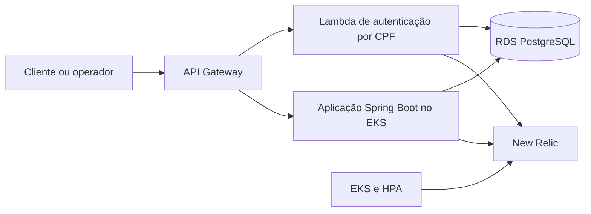

# Oficina Backend — Tech Challenge Fase 3

[](https://github.com/tiagomiele/oficina-backend-fiap-fase3/actions/workflows/ci.yml)

API principal do sistema de gestão de oficina mecânica. A Fase 3 evolui a base da Fase 2 para autenticação serverless por CPF, API Gateway, infraestrutura dividida em repositórios independentes e observabilidade com New Relic.

## Responsabilidades

Este repositório contém somente a aplicação Spring Boot e os artefatos necessários para executá-la em Kubernetes:

- regras de negócio e fluxo das Ordens de Serviço;
- APIs administrativas, técnicas e de cliente;
- persistência e migrações Flyway;
- validação dos JWTs emitidos pelo serviço serverless;
- métricas, logs estruturados e instrumentação APM;
- imagem Docker e deploy da aplicação no EKS.

A infraestrutura AWS, o banco gerenciado e a autenticação serverless pertencem a repositórios separados. O Terraform combinado da Fase 2 foi removido deste repositório e substituído por states e pipelines independentes.

## Arquitetura da solução



### Repositórios

| Repositório | Responsabilidade |
|---|---|
| [oficina-backend-fiap-fase3](https://github.com/tiagomiele/oficina-backend-fiap-fase3) | Aplicação principal no Kubernetes |
| [oficina-auth-serverless-fiap-fase3](https://github.com/tiagomiele/oficina-auth-serverless-fiap-fase3) | Lambda, autenticação por CPF, JWT e API Gateway |
| [oficina-kubernetes-infra-fiap-fase3](https://github.com/tiagomiele/oficina-kubernetes-infra-fiap-fase3) | VPC, EKS, HPA e integração Kubernetes/New Relic |
| [oficina-database-infra-fiap-fase3](https://github.com/tiagomiele/oficina-database-infra-fiap-fase3) | RDS PostgreSQL e infraestrutura de dados |

## Tecnologias

- Java 21 e Spring Boot 3.3;
- PostgreSQL 16, JPA/Hibernate e Flyway;
- Spring Security e JWT;
- JUnit 5, RestAssured, ArchUnit e JaCoCo;
- Docker, Kubernetes e HPA;
- GitHub Actions e GHCR;
- New Relic APM e logs estruturados.

## Executar localmente

### Pré-requisitos

- Docker Desktop com Docker Compose;
- ou Java 21 e PostgreSQL 16.

### Docker Compose

```bash
docker compose up --build
```

Serviços locais:

- API: `http://localhost:8080`
- Swagger: `http://localhost:8080/swagger-ui/index.html`
- Healthcheck: `http://localhost:8080/actuator/health`
- Adminer: `http://localhost:8081`

### Validar o projeto

```bash
./mvnw spotless:check
./mvnw verify
```

O `verify` executa testes unitários, testes de integração, ArchUnit e o gate de cobertura JaCoCo do domínio.

## Preparar homologação ou produção

Com os quatro repositórios clonados como diretórios irmãos, copie o bloco `[default]` do AWS Academy e execute:

```powershell
.\scripts\configure-environment.ps1 -Environment homolog
# ou
.\scripts\configure-environment.ps1 -Environment production
```

O script renova AWS CLI, HCP Terraform e GitHub Environments, preserva secrets fora do Git e sincroniza outputs entre os states. Ele não executa apply ou deploy. O CD permanece bloqueado sem erro até existirem outputs reais de EKS e RDS; depois disso, o próprio script habilita o deploy. Consulte o [guia geral](docs/validation/general-project.md).

## Documentação

- [Índice da documentação](docs/README.md)
- [Arquitetura geral](docs/architecture/overview.md)
- [Limites dos repositórios](docs/architecture/repository-boundaries.md)
- [Fluxo de autenticação por CPF](docs/architecture/authentication-flow.md)
- [Observabilidade com New Relic](docs/architecture/observability-new-relic.md)
- [Evolução do banco de dados](docs/architecture/database-evolution.md)
- [Migração da infraestrutura da Fase 2](docs/architecture/infrastructure-migration.md)
- [Contrato da API de autenticação](docs/contracts/authentication-api.yaml)
- [Guia geral de execução e validação do projeto](docs/validation/general-project.md)
- [Histórico de validação da Semana 1](docs/validation/week1.md)
- [Histórico de validação da Semana 2](docs/validation/week2.md)
- [Histórico de validação da Semana 3](docs/validation/week3.md)
- [Roadmap da Fase 3](docs/roadmap/phase3.md)
- [Documentação preservada da Fase 2](docs/fase2/README-fase2.md)

## Segurança e configuração

Segredos não devem ser versionados. Banco, JWT, New Relic e SMTP são configurados por variáveis de ambiente e GitHub Environments. Consulte os documentos específicos antes de executar deploy.

## Contribuição

- não são permitidos commits diretos na `main`;
- toda mudança deve passar por Pull Request;
- o CI deve estar aprovado antes do merge;
- mudanças arquiteturais devem atualizar RFCs ou ADRs.
