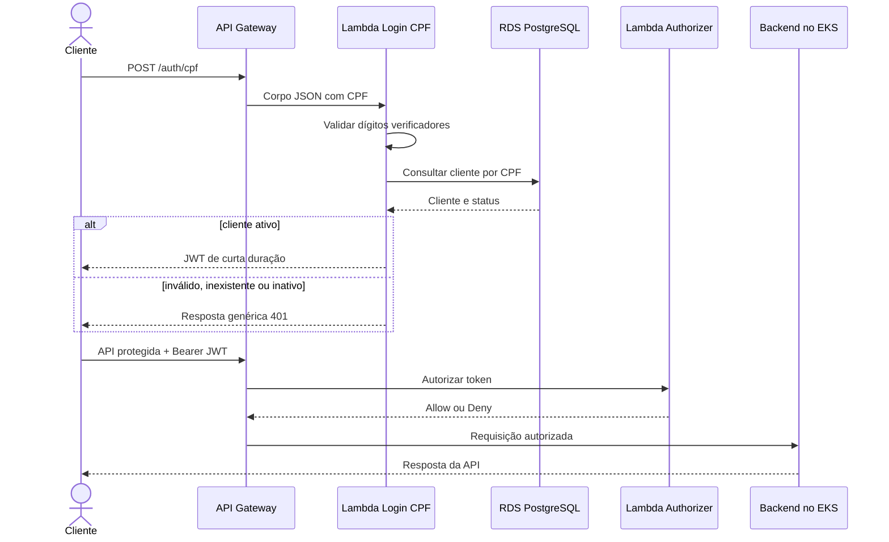

# Autenticação serverless por CPF

## Fluxo

## Regras

- aceitar CPF com ou sem máscara e persistir/consultar somente o valor normalizado;
- validar formato e dígitos verificadores antes de consultar o banco;
- responder de forma genérica para evitar enumeração de clientes;
- emitir tokens com `sub`, `client_id`, `role`, `iss`, `aud`, `iat`, `exp` e `jti`;
- não incluir CPF completo no token;
- usar expiração curta e assinatura assimétrica;
- armazenar a chave privada fora do código;
- validar token no API Gateway e manter defesa adicional no backend;
- não registrar CPF ou token em logs e eventos.

## Acesso ao banco

A Lambda de login executa nas subnets privadas, reutiliza o security group autorizado no RDS e consulta o PostgreSQL por JDBC. RDS Proxy poderá ser avaliado depois conforme permissões e custos do AWS Academy.

## Contrato

O contrato inicial está em [authentication-api.yaml](../contracts/authentication-api.yaml). Alterações incompatíveis exigem nova versão do endpoint e atualização do RFC correspondente.
