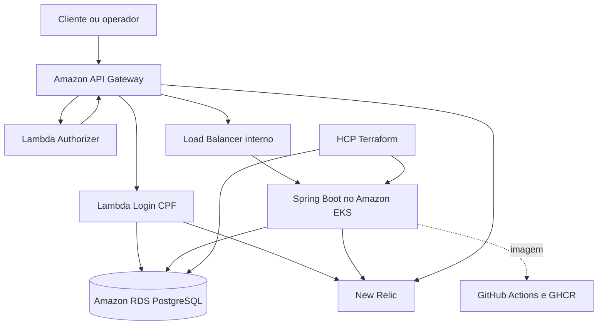

# Arquitetura geral

## Objetivo

Separar autenticação, aplicação, Kubernetes e banco gerenciado em unidades independentes de código e entrega, mantendo integração por contratos explícitos.

## Fluxos principais

1. O cliente envia o CPF ao endpoint público de autenticação.
2. A Lambda valida o documento e consulta a existência e o status do cliente.
3. Um JWT de curta duração é devolvido ao cliente.
4. O token acompanha as chamadas protegidas pelo API Gateway.
5. O autorizador valida assinatura, emissor, audiência e expiração.
6. O API Gateway encaminha a chamada autorizada para a aplicação no EKS.
7. Aplicação, Lambda, Kubernetes e API Gateway enviam telemetria ao New Relic.

## Princípios

- um repositório por unidade independente de entrega;
- nenhum módulo compartilhado por cópia de código;
- contratos versionados para integração;
- infraestrutura e estados Terraform separados;
- menor privilégio possível dentro das limitações do AWS Academy;
- nenhum CPF completo em logs, traces ou métricas;
- mudanças na `main` somente por Pull Request.

## Ambientes

| Ambiente lógico | Branch | Finalidade |
|---|---|---|
| Homologação | `homolog` | integração e demonstração antes da entrega |
| Produção | `main` | versão estável aprovada |

Os ambientes utilizam a mesma conta temporária do AWS Academy e devem ser recriáveis por pipeline. Os nomes dos recursos e os estados Terraform permanecem separados.
