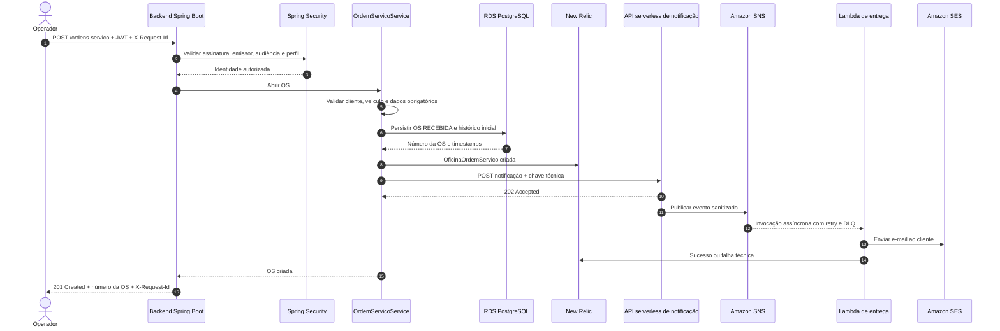

# Sequência de abertura da Ordem de Serviço

## Garantias

- A autenticação e autorização ocorrem antes da execução do caso de uso.
- A OS e seu histórico inicial são gravados na mesma transação.
- O `X-Request-Id` é preservado nos logs e eventos de observabilidade.
- A indisponibilidade da notificação não desfaz a OS já criada; a falha é registrada tecnicamente.
- O SNS executa a entrega assíncrona e encaminha falhas definitivas para a DLQ.
- CPF, credenciais e conteúdo integral da mensagem não são enviados a logs ou métricas.
